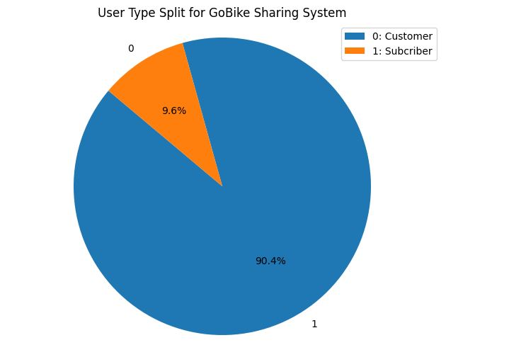
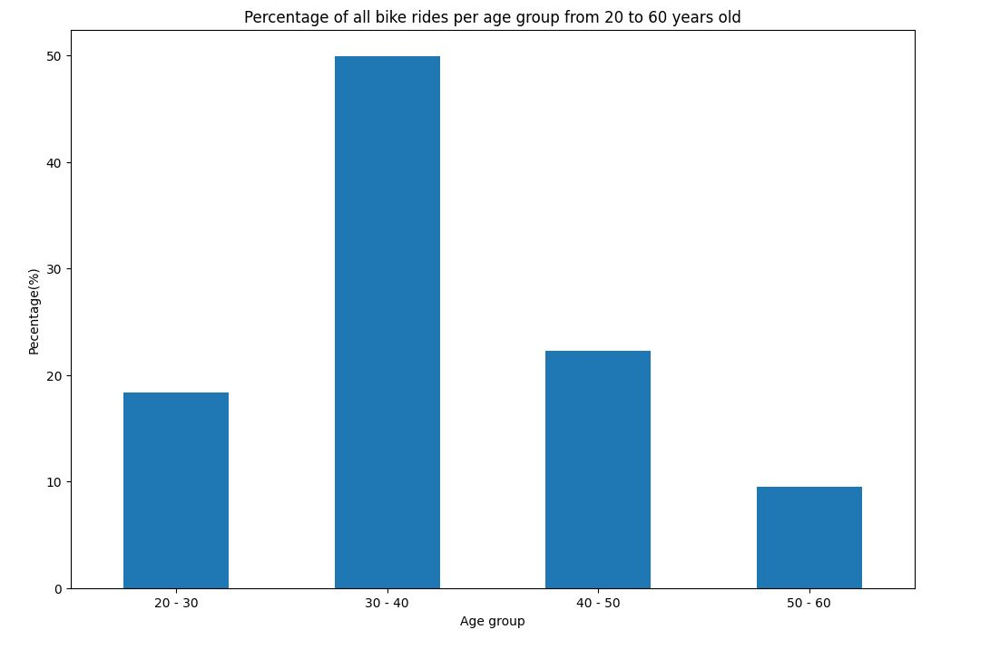

# Unveiling Trends in Ford GoBike Trip Data

## Domain Background

Ford GoBike is a bicycle-sharing service operating in the San Francisco Bay Area, offering residents and visitors a sustainable transportation option. The system allows users to rent bikes for short-term use, providing an eco-friendly alternative to traditional transportation methods. The dataset we’re examining includes detailed trip information such as duration, start and end times, stations, and user demographics.

## Problem Statement

With the wealth of data available from the Ford GoBike system, several key questions arise:

1. **How are trip durations distributed among users?**
   Understanding the duration of bike trips helps in assessing user behavior and system performance.
   
2. **What is the distribution of user types in the GoBike sharing system?**
   Identifying the proportion of different user types—subscribers versus customers—can shed light on user engagement and retention strategies.
   
3. **How does bike ride usage vary across different age groups?**
   Knowing which age groups are most active can assist in tailoring services and marketing efforts to different demographics.

## Dataset

The data collect from Kaggle. You can access the dataset and more details [Ford GoBike System Data](https://www.kaggle.com/datasets/ahmedmohameddawoud/ford-gobike-system-data)

## Solution Statement

To address these questions, we analyzed the Ford GoBike dataset and visualized the results

## Analysis

### Question 1: What is the distribution of trip durations in the dataset?

Calculations provided serve the purpose of visually and numerically summarizing the distribution of trip durations, specifically after applying a logarithmic transformation

Answer: The histogram shows that trip durations are right-skewed, with a peak towards shorter durations and a long tail extending towards longer durations. 
This range helps in understanding the variability of trip durations and identifying any exceptionally short or long trips that may warrant further investigation.

### Question 2: What is the distribution of user types in the GoBike sharing system?

A pie chart illustrated that subscribers significantly outnumber customers. This insight indicates that regular users form the core of the GoBike service, emphasizing the importance of retaining these frequent riders.

Answer: According to the chart, we see that the number of subscribers is more than customers, nearly 10 times more

### Question 3: How does the percentage of bike rides vary across different age groups from 20 to 60 years old?

We created a bar plot to show how bike usage varies across different age groups from 20 to 60 years old. This visualization helps identify which age groups are most engaged with the service, providing valuable information for targeted marketing and service improvement.

 

Answer: The plot helps identify which age groups contribute the most to bike ride usage within the specified range of 20 to 60 years old.
The bar plot visually compares the percentage of bike rides across different age groups

### Correlation analysis

Additionally, a correlation analysis revealed minimal relationships between ride duration and user age, as well as no significant correlation between ride duration and the latitude of starting stations. This suggests that while user demographics and station locations may have some impact, they are not major factors influencing ride duration.

The heatmap shows a weak positive correlation between duration_sec and member_age, with a correlation coefficient of around 0.003 The heatmap reveals no significant correlation between duration_sec and start_station_latitude. The correlation coefficient is close to zero, indicating that the latitude of the starting station does not influence ride duration.

These insights help in understanding user behavior and optimizing the GoBike system to better meet the needs of its diverse user base.

- **There’s a very weak positive correlation** between ride duration and user age.
- **There’s no significant correlation** between ride duration and the latitude of the starting station.

**Key Insight:** Age has a minimal impact on ride duration, and the starting station’s location doesn’t significantly affect how long people ride.

We hope these insights help you understand more about how people use the GoBike system. For a deeper dive into the technical aspects of the analysis, including methodologies and detailed results, check out our detailed report on GitHub

Happy biking! 🚴‍♀️🚴‍♂️
